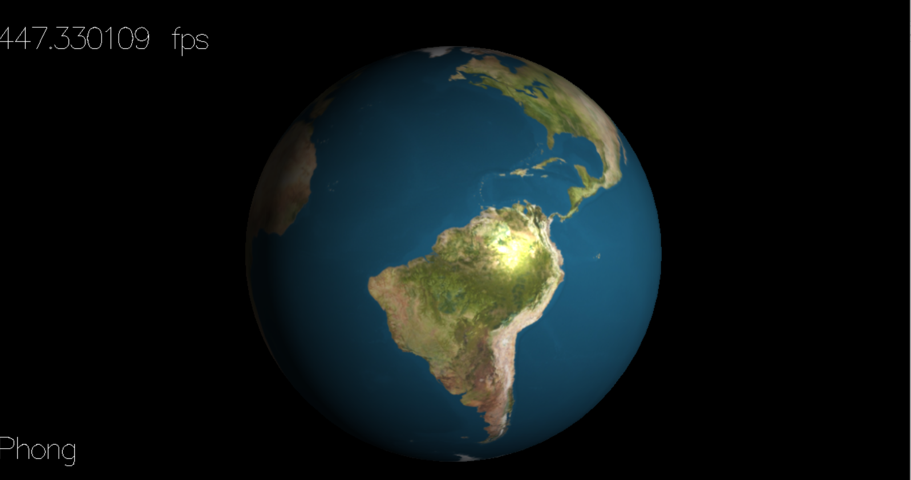
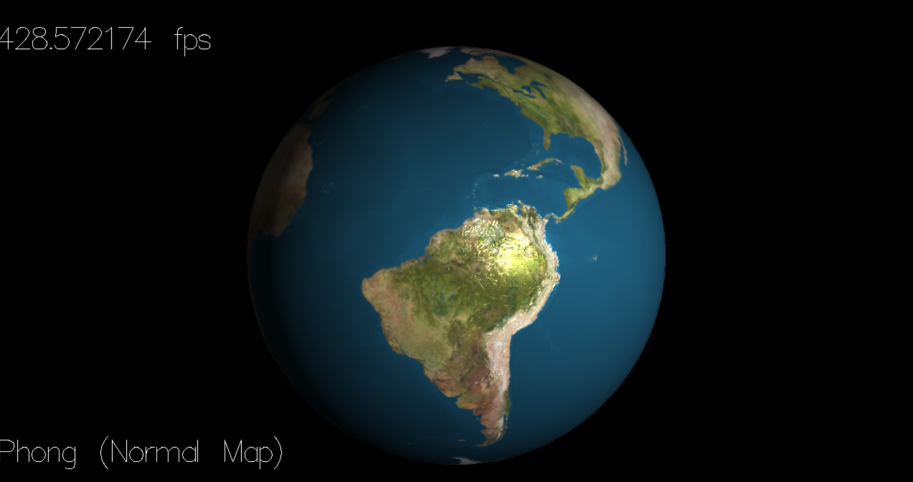
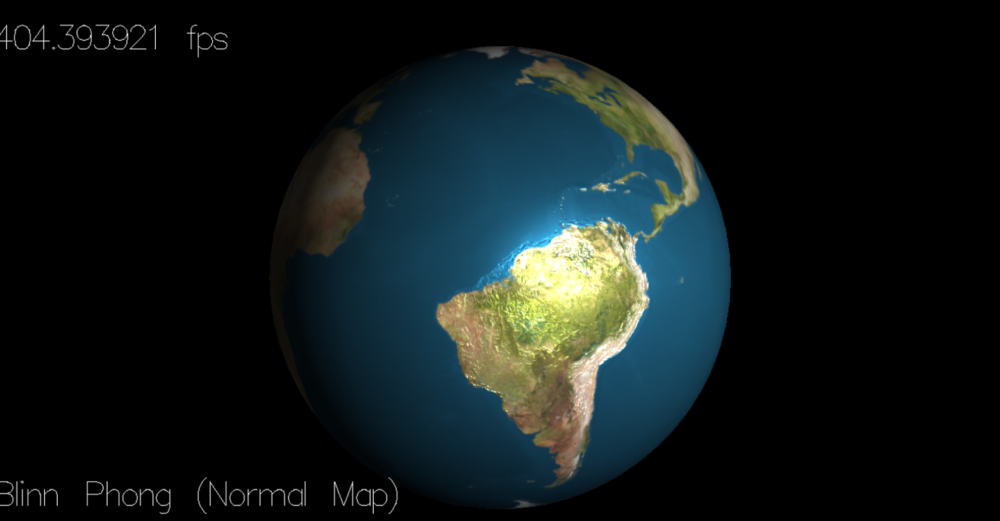

## How to Control
* click t to switch between phong/blinn phong/lut bilnn phong
* click n to turn on/off normal map
* click b to turn on/off displacement/bump map
## Results
* Comparision of Phong and Phong with Normal Map on earth rendering  
    
* Comparision of Blinn-Phong and Blinn-Phong with Normal Map on earth rendering  
    

*Blinn-Phong with Normal Map Animation  

  

*Blinn-Phong with Normal Map + Bump Map Animation  

  

